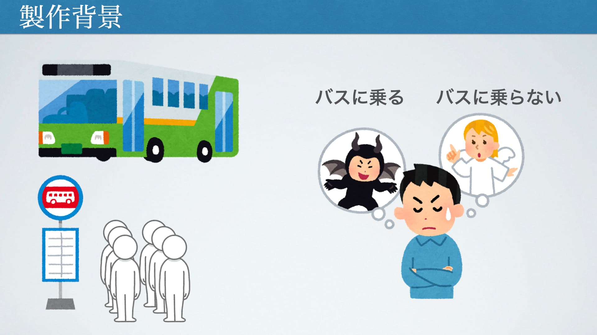

# 
インターン 自作Webアプリ 簡易仕様

 

## アプリ名
**愛工大バス時刻案内**  

- [こちらのページで公開しています](https://ogane.sakura.ne.jp/AIT-BusInfo/index.html)
  

## 使用言語等
- HTML
	- 以下のテンプレートを使用しています．
	- [https://html5up.net/stellar](https://html5up.net/stellar)
- CSS
- JavaScript
  

## Webアプリ概要
愛知工業大学が運行しているシャトルバスの時刻表アプリです。  
次何時にバスが出発するのかを一目で確認できるアプリになっています。  
Webアプリではありますが、PWA(プログレッシブウェブアプリ)の技術に対応しているので、インストールすることでネイティブアプリケーションと同じように使用できます。  

  

## 画面概要

### Next Time
- 次に発車するバスと、次の次に発車するバスの時間を表示します。  
- 時間は以下のように `八草 → 大学` と `大学 → 八草` を分けて表示します。  
- 1秒ごとに最新の情報に更新します。
- その日のバスの運行が終了したら、「本日の運行は終了しました」と表示します。  
- 午前0時から始発の時間までは、その日の最初の発車時間が表示されます。  
- もし、バスの運行が無い日はこの項目は表示されません。

### お知らせ
- アップデートや運行情報に関する情報を表示します。

### 本日の運行ダイヤ
- その日の運行ダイヤを表示します。
- もし、バスの運行が無い日は「本日バスの運行はありません」と表示されます。

### 八草 → 大学
- その日の運行ダイヤに合わせた`八草 → 大学間`の時刻表を表示します。
- もし、バスの運行が無い日はこの項目は表示されません。

### 大学 → 八草
- その日の運行ダイヤに合わせた`大学 → 八草間`の時刻表を表示します。
- もし、バスの運行が無い日はこの項目は表示されません。

### インストール方法
- Webアプリをデバイスにインストールする方法の紹介ページへのリンクを掲載しています。

  

## 制作経緯
このWebアプリを作った理由として、次の出発時間がすぐに分からないという理由があります。
最寄り駅の八草駅から大学までは少し距離があるため、多くの学生が毎朝シャトルバスを利用しています。
この時まずは、時刻表を確認してすぐにバスに乗れそうか確認すると思いますが、シャトルバスは大学が運行しており曜日やイベントによって運行ダイヤが異なるため、まずはその日の運行ダイヤを調べてからそれに合う時刻表を確認する必要があります。
しかし、大学から提供されている時刻表はPDF形式のみとなっており、また運行ダイヤと各時刻表の情報は別々のPDFファイルとなっています。
そのため、次何時にバスが出発するのか確認するのに非常に手間が掛かり面倒くさいです。
そこで、一目で次の出発時間がわかるサービスがあれば便利ではないかと考え制作を行いました。

  

## アドバイスを頂きたいポイント
### デザインについて
今回のWebアプリのデザインは、無償で公開されているテンプレートを使用して作っています。
そのため、このようなテンプレートに頼らずとも自分で考えたデザインを実現できるように、CSSの基礎から最近流行りのデザインの作り方まで、幅広く教えて頂きたいです。

### コードについて
高い保守性を実現するコードの書き方やモダンな書き方などを教えて頂きたいと考えています。